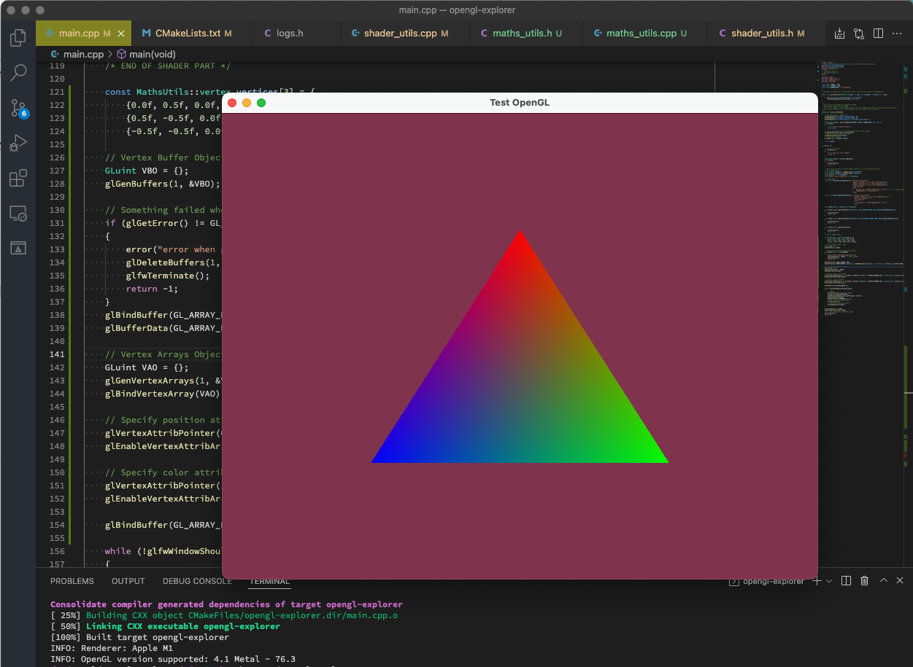

# OpenGL-Explorer

A toy example to explore both C++17 and OpenGL (4.1) on an m1 mac, for ARM specifically (no rosetta2 here).

This repository was just a test example for the blog post, and does not have a "future".  
I archived it then, as I don't plan to improve the code or add more features in the future.

## How to build

First, please to make sure that:
* you have a clang version that supports C++17 (I used `Apple clang version 13.0.0 (clang-1300.0.29.30)` for this exercise),
* the following tools: `make`, `cmake`, `c++`,
* a macintosh computer (this exercise does not supports other platforms yet).

Now, in the root folder: `cmake . && make && ./opengl-explorer`.

I wrote a blog post about this exercise here, please take a look for the troubleshootings: [blog post](https://carette.xyz/posts/opengl_and_cpp_on_m1_mac/).

## Interaction

* `Esc` to quit the program (or ctrl-c in your terminal),
* `r` to reload the shaders, if you modify the `fragment_shader.glsl` or `vertex_shader.glsl` files.

## Screenshot

